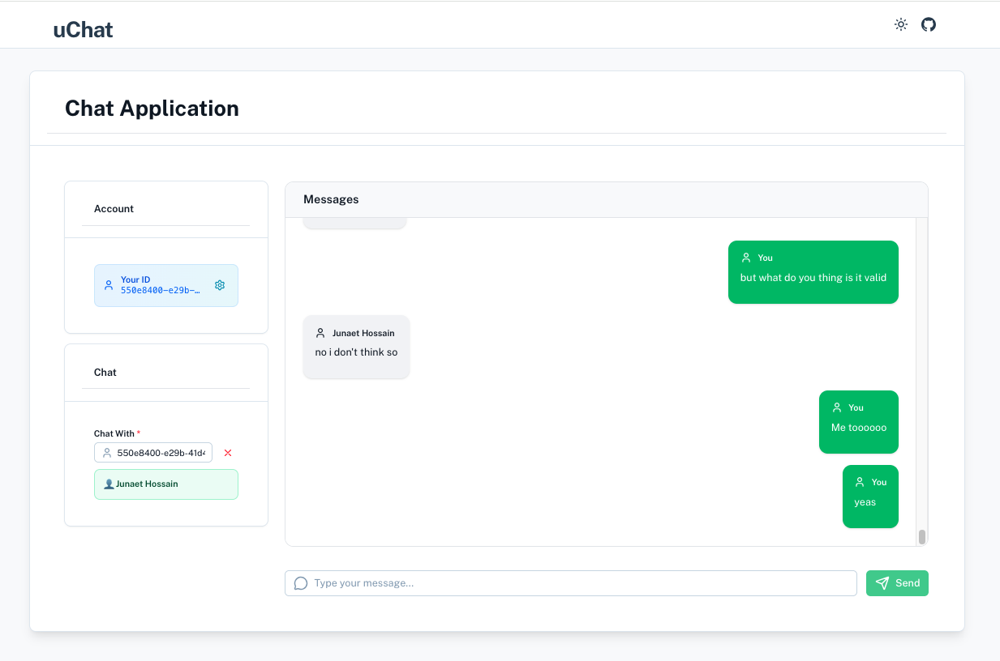
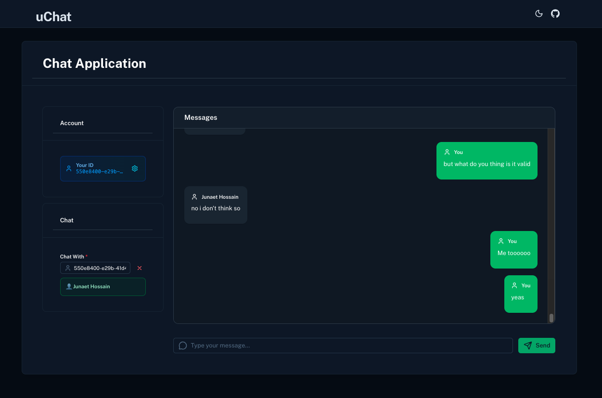
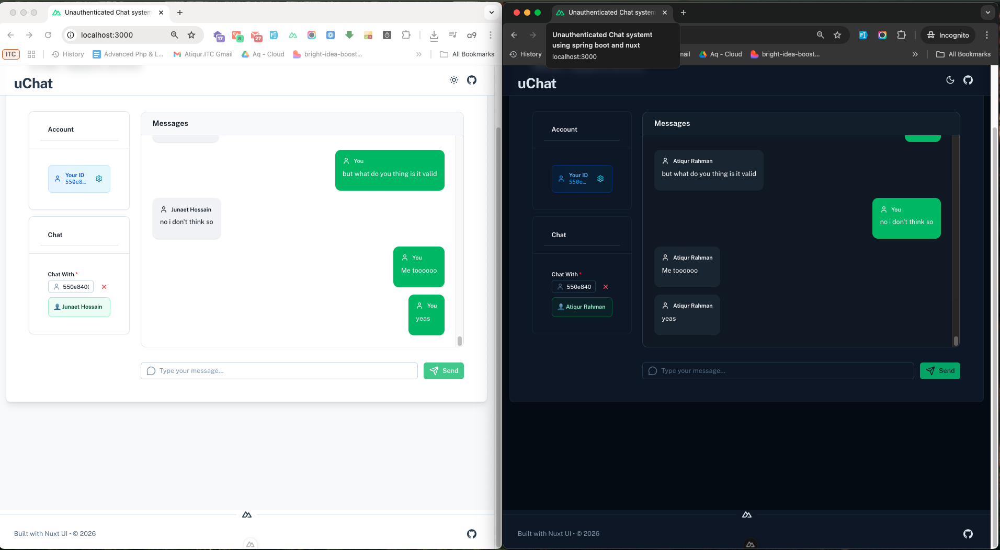

# Java Non-Authenticate Messaging App - Spring Boot

A real-time messaging application built with **Spring Boot** (Backend) and **Nuxt.js/Vue 3** (Frontend) that enables users to send, edit, and delete messages in real-time using **Pusher** for instant notifications.

**Author:** [@AtiqurCode](https://github.com/AtiqurCode)

---

## 📚 Project Structure

This is a **monorepo** containing two applications:

- **Backend (Java Spring Boot):** `/springchat` - REST API server
- **Frontend (Nuxt.js/Vue 3):** `https://github.com/AtiqurCode/java-not-authenticate-messaging-app-spring-boot-frontend` - Web UI

---

## ✨ Features

- ✅ Send real-time messages between users
- ✅ Edit messages with instant sync to recipient
- ✅ Delete messages with push notifications
- ✅ Real-time updates using Pusher
- ✅ User profiles and UUID-based identification
- ✅ Browser notifications for incoming messages
- ✅ Responsive design (Mobile & Desktop)
- ✅ Dark mode support
- ✅ Message timestamps with hover tooltips

---

## � Screenshots

### Light & Dark Mode Support

The application features a beautiful responsive design with full dark mode support:

<div align="center">
  
  
  
  <video src="public/screenshots/demo.webm" alt="Demo" width="45%" controls autoplay muted loop>
    Your browser does not support the video tag.
  </video>
</div>

### Key Features in Action

| Feature | Description |
|---------|-------------|
| **Real-time Messaging** | Send and receive messages instantly with Pusher |
| **Theme Toggle** | Switch between light and dark modes seamlessly |
| **Message Management** | Edit and delete messages with instant sync |
| **UUID-based Identity** | Simple user identification without authentication |
| **Responsive Design** | Works perfectly on desktop and mobile devices |

> **Note:** Place your screenshots in the `public/screenshots/` directory. Recommended files:
> - `uchat2.png` - Application in light mode
> - `uchat3.png` - Application in dark mode
> - `demo.webm` - (Optional) Animated demo of features

---

## �🛠️ Tech Stack

### Backend (This Repository)
- **Framework:** Spring Boot 3.x
- **Language:** Java
- **Database:** MySQL
- **Real-time:** Pusher
- **Build Tool:** Maven
- **Database Migration:** Flyway

### Frontend
- **Framework:** Nuxt.js 3
- **Language:** TypeScript
- **Styling:** Tailwind CSS
- **Real-time Client:** Pusher.js
- **Package Manager:** pnpm

---

## 📋 Prerequisites

### Backend Requirements
- **Java** 21 or higher
- **Maven** 3.8.0 or higher
- **MySQL** 8.0 or higher
- **Git**

### Frontend Requirements
- **Node.js** 18 LTS or higher
- **pnpm** 8.0 or higher (or npm/yarn)
- **Git**

---

## 🚀 Quick Start

### 1. Backend Setup (Spring Boot)

#### Clone the repository
```bash
git clone https://github.com/AtiqurCode/java-not-authenticate-messaging-app-spring-boot.git
cd springchat
```

#### Configure Database
Create a MySQL database:
```sql
CREATE DATABASE springchat_db;
```

Update `src/main/resources/application.properties` with your database credentials:
```properties
# Database Configuration
spring.datasource.url=jdbc:mysql://localhost:3306/springchat_db
spring.datasource.username=root
spring.datasource.password=your_password
spring.datasource.driver-class-name=com.mysql.cj.jdbc.Driver

# JPA/Hibernate Configuration
spring.jpa.hibernate.ddl-auto=validate
spring.jpa.show-sql=false
spring.jpa.properties.hibernate.dialect=org.hibernate.dialect.MySQL8Dialect

# Flyway Migration
spring.flyway.enabled=true
spring.flyway.locations=classpath:db/migration

# Server Configuration
server.port=8081
```

#### Configure Pusher (Optional for Real-time Features)
Update Pusher credentials in your configuration:
```properties
# Pusher Configuration
pusher.app-id=YOUR_APP_ID
pusher.key=YOUR_APP_KEY
pusher.secret=YOUR_APP_SECRET
pusher.cluster=ap1
```

> **Get Pusher Credentials:** Sign up at [pusher.com](https://pusher.com) and create a new Channels app.

#### Build the project
```bash
./mvnw clean install
```

#### Run the server
```bash
./mvnw spring-boot:run
```

The backend will start on **http://localhost:8081**

---

### 2. Frontend Setup (Nuxt.js)

#### Clone the repository
```bash
git clone https://github.com/AtiqurCode/java-not-authenticate-messaging-app-spring-boot-frontend.git
cd chatmodule
```

#### Install dependencies
Using pnpm (recommended):
```bash
pnpm install
```

Or using npm:
```bash
npm install
```

#### Configure API Base URL
Update `nuxt.config.ts` with the backend API URL:
```typescript
export default defineNuxtConfig({
  runtimeConfig: {
    public: {
      apiBase: 'http://localhost:8081/api/v1',
      pusherKey: 'YOUR_PUSHER_KEY',
      pusherCluster: 'ap1'
    }
  }
})
```

You can also create a `.env` file in the frontend root directory:
```env
NUXT_PUBLIC_API_BASE=http://localhost:8081/api/v1
NUXT_PUBLIC_PUSHER_KEY=YOUR_PUSHER_KEY
NUXT_PUBLIC_PUSHER_CLUSTER=ap1
```

#### Run the development server
```bash
pnpm dev
```

Or with npm:
```bash
npm run dev
```

The frontend will start on **http://localhost:3000**

---

## 🎯 Running Both Applications

For the best experience, you need both backend and frontend running:

### Option 1: Separate Terminals (Recommended for Development)

**Terminal 1 - Backend:**
```bash
cd springchat
./mvnw spring-boot:run
```

**Terminal 2 - Frontend:**
```bash
cd chatmodule
pnpm dev
```

### Option 2: Production Build

**Backend:**
```bash
cd springchat
./mvnw clean package
java -jar target/springtest-0.0.1-SNAPSHOT.jar
```

**Frontend:**
```bash
cd chatmodule
pnpm build
pnpm preview
```

### Verify Setup
1. Backend should be running at: **http://localhost:8081**
2. Frontend should be running at: **http://localhost:3000**
3. Test backend health: `curl http://localhost:8081/api/v1/chats`

---

## 📖 Usage Instructions

### 1. Access the Application
- Open your browser and navigate to **http://localhost:3000**

### 2. Set Your User ID
- Enter a unique UUID (you can generate one or use any string)
- This will be saved locally in your browser

### 3. Find a User to Chat
- Enter the recipient's UUID
- Click "Find" to fetch their profile
- Chats will auto-load after finding the user

### 4. Send Messages
- Type your message in the input field
- Press Enter or click Send
- Messages appear in real-time with your name

### 5. Edit Messages
- Hover over your message
- Click the blue pencil icon to edit
- Type the new message and click Save
- The recipient sees the update instantly via Pusher

### 6. Delete Messages
- Hover over your message
- Click the red trash icon to delete
- The message is removed from both users' screens in real-time

### 7. View Message Time
- Hover over any message
- A tooltip shows the exact date and time

---

## 🔌 API Endpoints

### Chat Endpoints
- **POST** `/api/v1/chats` - Create a new message
- **GET** `/api/v1/chats` - Get all messages
- **GET** `/api/v1/chats/{id}` - Get message by ID
- **PUT** `/api/v1/chats/{id}` - Update/edit a message
- **DELETE** `/api/v1/chats/{id}` - Delete a message
- **POST** `/api/v1/chats/between` - Get messages between two users
- **POST** `/api/v1/chats/sent` - Get messages sent by a user
- **POST** `/api/v1/chats/received` - Get messages received by a user

### User Endpoints
- **GET** `/api/v1/users/uuid/{uuid}` - Get user by UUID

### Pusher Test
- **POST** `/api/v1/chats/test-pusher/{userUuid}` - Test Pusher connectivity

---

## 📦 Database Schema

### Users Table
```sql
CREATE TABLE users (
  uuid VARCHAR(255) PRIMARY KEY,
  name VARCHAR(255) NOT NULL,
  created_at TIMESTAMP DEFAULT CURRENT_TIMESTAMP
);
```

### Chats Table
```sql
CREATE TABLE chats (
  id BIGINT AUTO_INCREMENT PRIMARY KEY,
  chat_from_uuid VARCHAR(255) NOT NULL,
  chat_to_uuid VARCHAR(255) NOT NULL,
  message LONGTEXT NOT NULL,
  is_encrypted BOOLEAN DEFAULT FALSE,
  created_at TIMESTAMP DEFAULT CURRENT_TIMESTAMP,
  updated_at TIMESTAMP DEFAULT CURRENT_TIMESTAMP ON UPDATE CURRENT_TIMESTAMP,
  deleted_at TIMESTAMP NULL,
  INDEX idx_chat_from (chat_from_uuid),
  INDEX idx_chat_to (chat_to_uuid),
  INDEX idx_created_at (created_at),
  FOREIGN KEY (chat_from_uuid) REFERENCES users(uuid) ON DELETE CASCADE,
  FOREIGN KEY (chat_to_uuid) REFERENCES users(uuid) ON DELETE CASCADE
);
```

### Database Migrations
The project uses **Flyway** for database version control. Migrations are located in `src/main/resources/db/migration/`:

- **V1__Create_Users_And_Chats_Tables.sql** - Initial schema
- **V2__Insert_Sample_Data.sql** - Sample users and messages
- **V3__Add_Updated_At_To_Chats.sql** - Add updated_at column
- **V4__Add_Encryption_Support.sql** - Add encryption support (if applicable)

---

## 🔒 Security Notes

- This is a demonstration project with **no authentication**
- UUIDs are used for user identification (not secure for production)
- All messages are visible to anyone who knows the UUIDs
- For production use, implement proper authentication and encryption

---

## 📂 Project Structure

### Backend (Spring Boot)
```
springchat/
├── docs/
│   └── screenshots/          # Project screenshots and visual assets
│       └── README.md         # Screenshots documentation
├── src/
│   ├── main/
│   │   ├── java/
│   │   │   └── com/example/springtest/
│   │   │       ├── controller/
│   │   │       │   ├── ChatController.java
│   │   │       │   └── UserController.java
│   │   │       ├── service/
│   │   │       │   ├── ChatService.java
│   │   │       │   ├── UserService.java
│   │   │       │   └── PusherService.java
│   │   │       ├── entity/
│   │   │       │   ├── Chat.java
│   │   │       │   └── User.java
│   │   │       ├── repository/
│   │   │       │   ├── ChatRepository.java
│   │   │       │   └── UserRepository.java
│   │   │       ├── dto/
│   │   │       │   └── ChatDTO.java
│   │   │       └── config/
│   │   │           ├── PusherConfig.java
│   │   │           └── CorsConfig.java
│   │   └── resources/
│   │       ├── application.properties
│   │       └── db/migration/
│   │           ├── V1__Create_Users_And_Chats_Tables.sql
│   │           ├── V2__Insert_Sample_Data.sql
│   │           └── V3__Add_Updated_At_To_Chats.sql
│   └── test/
│       └── java/
├── target/                   # Compiled classes and build artifacts
├── pom.xml                   # Maven dependencies and build config
├── mvnw                      # Maven wrapper (Unix/Mac)
├── mvnw.cmd                  # Maven wrapper (Windows)
└── README.md                 # This file
```

### Frontend (Nuxt.js)
```
chatmodule/
├── app/
│   ├── components/           # Vue components
│   │   ├── ChatMessages.vue
│   │   ├── SendMessageInput.vue
│   │   ├── RecipientInput.vue
│   │   └── UserUuidDisplay.vue
│   ├── composables/          # Vue composables
│   │   └── useEncryption.ts
│   ├── pages/
│   │   └── index.vue         # Main chat page
│   ├── utils/
│   │   └── encryption.ts     # Encryption utilities
│   └── app.vue               # Root component
├── public/
│   └── screenshots/          # Public screenshot assets
├── server/
│   └── routes/
│       └── pusher/
│           └── auth.post.ts  # Pusher authentication
├── nuxt.config.ts            # Nuxt configuration
├── package.json
└── README.md
```

---

## 🧪 Testing

### Backend Testing

#### Manual API Testing
```bash
# Health check
curl http://localhost:8081/api/v1/chats

# Test Pusher connectivity
curl -X POST http://localhost:8081/api/v1/chats/test-pusher/user-123

# Create a test message
curl -X POST http://localhost:8081/api/v1/chats \
  -H "Content-Type: application/json" \
  -d '{
    "chatFromUuid": "550e8400-e29b-41d4-a716-446655440000",
    "chatToUuid": "550e8400-e29b-41d4-a716-446655440001",
    "message": "Hello, this is a test message!"
  }'

# Get messages between two users
curl -X POST http://localhost:8081/api/v1/chats/between \
  -H "Content-Type: application/json" \
  -d '{
    "userUuid1": "550e8400-e29b-41d4-a716-446655440000",
    "userUuid2": "550e8400-e29b-41d4-a716-446655440001"
  }'

# Update a message
curl -X PUT http://localhost:8081/api/v1/chats/1 \
  -H "Content-Type: application/json" \
  -d '{
    "message": "Updated message content"
  }'

# Delete a message
curl -X DELETE http://localhost:8081/api/v1/chats/1

# Get user by UUID
curl http://localhost:8081/api/v1/users/uuid/550e8400-e29b-41d4-a716-446655440000
```

### Frontend Testing

#### Testing in Browser
1. Open **http://localhost:3000**
2. Open browser DevTools (F12)
3. Check Console tab for any errors
4. Check Network tab to verify API calls
5. Test dark mode toggle
6. Send messages and verify real-time updates

#### Testing with Multiple Users
1. Open the app in two different browsers (or incognito mode)
2. Use different UUIDs for each user
3. Send messages between them
4. Verify real-time delivery via Pusher

---

## 🎨 Screenshots & Documentation

Project screenshots are organized in the following directories:

- **Backend:** `springchat/docs/screenshots/`
- **Frontend:** `chatmodule/public/screenshots/`

To add screenshots:
1. Place PNG/JPG images in the appropriate directory
2. Use descriptive filenames (e.g., `light-mode.png`, `dark-mode.png`)
3. Update this README to reference new screenshots
4. Optimize images to keep file sizes reasonable (< 1MB each)

---

## 🐛 Troubleshooting

### Backend Issues

**Port 8081 already in use:**
```bash
# Option 1: Change port in application.properties
server.port=8082

# Option 2: Kill process using port 8081 (macOS/Linux)
lsof -ti:8081 | xargs kill -9

# Option 3: Kill process using port 8081 (Windows)
netstat -ano | findstr :8081
taskkill /PID <PID> /F
```

**MySQL connection failed:**
- Ensure MySQL is running: `mysql -u root -p`
- Check database exists: `SHOW DATABASES;`
- Verify credentials in `application.properties`
- Check MySQL is running on port 3306: `netstat -an | grep 3306`

**Flyway migration errors:**
```bash
# Reset database (WARNING: deletes all data)
DROP DATABASE springchat_db;
CREATE DATABASE springchat_db;

# Then restart the Spring Boot application
./mvnw spring-boot:run
```

**Pusher not working:**
- Verify Pusher credentials are correct in `application.properties`
- Check API limits and quotas on Pusher dashboard
- Ensure your Pusher app is in the correct cluster (e.g., `ap1`)
- Check backend logs for Pusher event details
- Verify CORS is properly configured

**Build failures:**
```bash
# Clean build
./mvnw clean

# Skip tests
./mvnw clean install -DskipTests

# Update dependencies
./mvnw dependency:resolve
```

### Frontend Issues

**Port 3000 already in use:**
```bash
# Option 1: Use different port
pnpm dev -- --port 3001

# Option 2: Kill process (macOS/Linux)
lsof -ti:3000 | xargs kill -9
```

**API not responding:**
- Verify backend is running on `http://localhost:8081`
- Check `nuxt.config.ts` API base URL matches backend port
- Open browser DevTools → Network tab to see API calls
- Verify CORS configuration on backend

**Real-time updates not working:**
- Check Pusher connection in browser DevTools → Network → WS (WebSocket)
- Verify you're subscribed to correct channel: `chat-{YOUR_UUID}`
- Check browser console for Pusher connection errors
- Ensure Pusher key matches between frontend and backend
- Verify internet connection (Pusher requires external connectivity)

**Dependencies installation failed:**
```bash
# Clear cache and reinstall
rm -rf node_modules pnpm-lock.yaml
pnpm install

# Or use npm
rm -rf node_modules package-lock.json
npm install
```

**Dark mode not working:**
- Check browser console for CSS errors
- Clear browser cache (Ctrl+Shift+Delete)
- Verify Tailwind CSS is properly configured

### General Issues

**CORS errors in browser console:**
Add this configuration to your Spring Boot backend:
```java
@Configuration
public class CorsConfig implements WebMvcConfigurer {
    @Override
    public void addCorsMappings(CorsRegistry registry) {
        registry.addMapping("/api/**")
                .allowedOrigins("http://localhost:3000")
                .allowedMethods("GET", "POST", "PUT", "DELETE")
                .allowCredentials(true);
    }
}
```

**Messages not syncing in real-time:**
1. Check both users are online
2. Verify Pusher credentials match on both frontend and backend
3. Check network tab for Pusher WebSocket connection
4. Ensure both users are subscribed to correct channels

---

## 🔧 Configuration Files

### Backend Configuration (`application.properties`)
```properties
# Server
server.port=8081

# Database
spring.datasource.url=jdbc:mysql://localhost:3306/springchat_db
spring.datasource.username=root
spring.datasource.password=your_password
spring.datasource.driver-class-name=com.mysql.cj.jdbc.Driver

# JPA
spring.jpa.hibernate.ddl-auto=validate
spring.jpa.show-sql=false
spring.jpa.properties.hibernate.dialect=org.hibernate.dialect.MySQL8Dialect

# Flyway
spring.flyway.enabled=true
spring.flyway.locations=classpath:db/migration

# Pusher
pusher.app-id=YOUR_APP_ID
pusher.key=YOUR_APP_KEY
pusher.secret=YOUR_APP_SECRET
pusher.cluster=ap1
```

### Frontend Configuration (`.env`)
```env
# API Configuration
NUXT_PUBLIC_API_BASE=http://localhost:8081/api/v1

# Pusher Configuration
NUXT_PUBLIC_PUSHER_KEY=YOUR_PUSHER_KEY
NUXT_PUBLIC_PUSHER_CLUSTER=ap1
```

### Maven Configuration (`pom.xml`)
Key dependencies:
- Spring Boot Starter Web
- Spring Boot Starter Data JPA
- MySQL Connector
- Flyway Core
- Pusher Java Server SDK
- Lombok

---

## 📚 Repository Links

- **Backend:** https://github.com/AtiqurCode/java-not-authenticate-messaging-app-spring-boot
- **Frontend:** https://github.com/AtiqurCode/java-not-authenticate-messaging-app-spring-boot-frontend

---

## 🤝 Contributing

Contributions are welcome! Please feel free to submit a Pull Request.

---

## 📄 License

This project is open source and available under the MIT License.

---

## 👨‍💻 Author

**Atiqur Code**
- GitHub: [@AtiqurCode](https://github.com/AtiqurCode)
- Email: Contact via GitHub

---

## 🙏 Acknowledgments

- Spring Boot framework
- Pusher for real-time capabilities
- Nuxt.js and Vue.js community
- MySQL and Flyway for database management

---

## 📞 Support

For issues, questions, or suggestions:
1. Open an issue on GitHub
2. Check existing issues and documentation
3. Contact the author via GitHub

---

**Happy Coding! 🚀**
